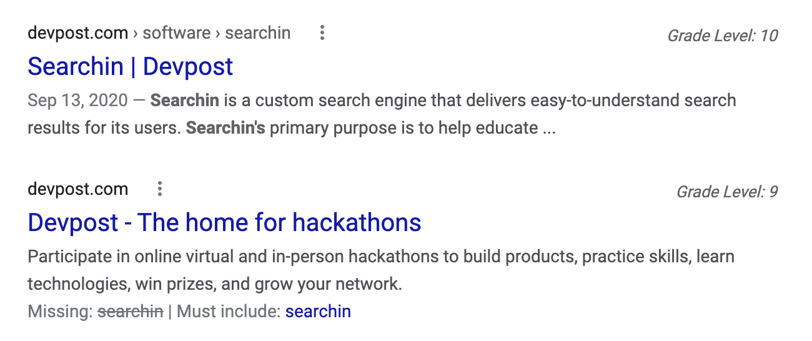

# searchin
Web Readability Scoring

# Development Environment for Chrome Extension 

### Add the [CORS Unblock Extension](https://chrome.google.com/webstore/detail/cors-unblock/lfhmikememgdcahcdlaciloancbhjino?hl=en) to Chrome
Make sure that CORS Unblock is enabled by clicking the icon in the extensions toolbar -- It should look like this:

**Don't want to install a CORS Unblock extension on the Chrome you use every day? You can download the developer version of Chrome, [Chrome Canary](https://www.google.com/intl/en/chrome/canary/?brand=KERZ#eula).**

### Clone this repository 

`git clone https://github.com/Samuel-Nathanson/searchin.git`
`cd searchin/searchin-extension`;

### Install Required Packages

`npm install`

## Run the optimized build script inside of searchin/searchin-extension
`npm run build`

### Load Searchin' as a packed Chrome Extension to your Web Browser

First, [Manage your Chrome Extensions](chrome://extensions/). Enable developer mode by clicking the toggle button on the top right. 

Next, click the **Load unpacked** button on the upper-left hand side of the screen. Select `/path/to/searchin/searchin-extension`. This folder contains manifest.json, which is a common file that all Chrome Extensions need. 

You should now see Searchin' in the list of Chrome Extensions. Make sure it's enabled through the toggle button on the lower right of the extensions card. 

Now, perform any Google Search -- If Searchin' is configured correctly, then you should see a Grade Level score next to each of the Google Search results.

